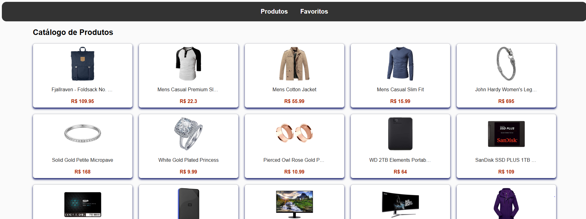
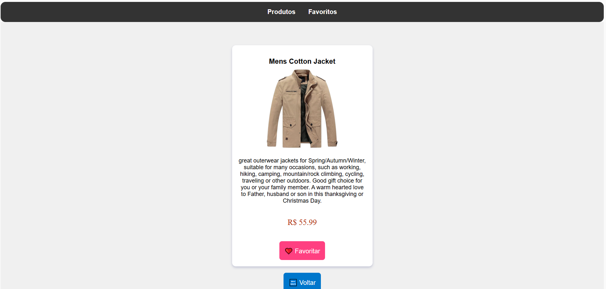
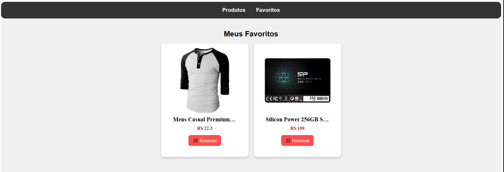

# 📦 FakeStore React

Uma **página de loja virtual fake** desenvolvida em **React**, contendo
listagem de produtos, página individual com detalhes e sistema de
favoritos usando `localStorage`.\
Projeto simples, ideal para estudos de **React**, **hooks**, **React
Router** e manipulação de estado.

---

## 🚀 Tecnologias Utilizadas

- **React**
- **React Router DOM**
- **Vite** (ambiente de desenvolvimento)
- **CSS puro**
- **localStorage** (para salvar favoritos)

---

## 📁 Estrutura do Projeto

    src/
    │ App.jsx
    │ main.jsx
    │ index.css
    │
    └── pages/
        ├── ListaProdutos.jsx
        ├── Produto.jsx
        └── Favoritos.jsx
        │
        ├── ListaProdutos.css
        ├── Produto.css
        └── Favoritos.css

---

## ⚙️ Como Rodar o Projeto

### 1️⃣ Clone o repositório

```bash
git clone https://github.com/seu-repo/fakestore-react.git
cd fakestore-react
```

### 2️⃣ Instale as dependências

```bash
npm install
```

### 3️⃣ Execute o projeto

```bash
npm run dev
```

O Vite iniciará o servidor local, geralmente em: http://localhost:5173/

---

## 🛍️ Funcionalidades

✔️ Listagem de produtos fake\
✔️ Visualização de detalhes do produto\
✔️ Favoritar e remover favorito\
✔️ Persistência dos favoritos via **localStorage**\
✔️ Navegação com **React Router**\
✔️ Interface simples e responsiva

---

## 📸 Screenshots





---

## 🧩 Rotas

Rota Página Descrição

---

`/` ListaProdutos Lista todos os produtos
`/product/:id` Produto Exibe detalhes de um produto
`/favorites` Favoritos Produtos marcados como favoritos

---

## 📄 Licença

Este projeto é livre para estudos.
